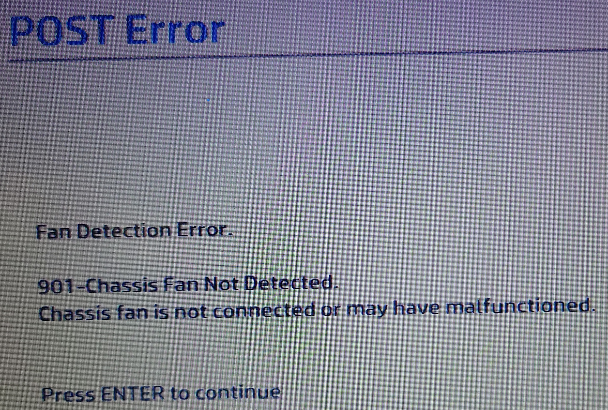
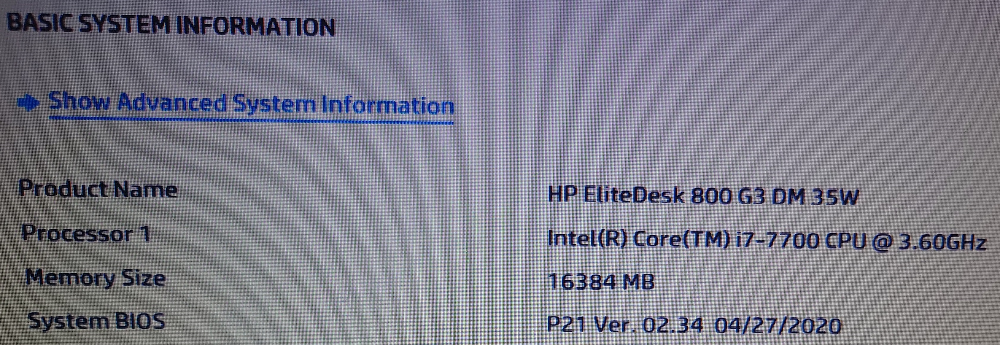

# PhantomKey
👻 PhantomKey – A stealthy USB HID device to auto-bypass BIOS errors like "Chassis Fan Not Detected".

# 👻 PhantomKey

**Pressing Enter from beyond the BIOS...**  
🩹 *“Patching up problems that shouldn’t need patching in the first place.”*

PhantomKey is a tiny USB gadget based on the Seeed XIAO SAMD21 that spoofs a keyboard to automatically bypass BIOS errors like "Chassis Fan Not Detected" by pressing Enter at just the right time — completely hands-free.

---

## 🧠 Problem Statement

Some motherboards throw a fit if a chassis fan isn’t connected — halting boot with an annoying prompt:  
> "**CPU Fan Error! Press Enter to continue.**"

This is fine for one reboot. But if you're running a headless server? Nightmare.

Enter **PhantomKey**. Plug it into any USB port and let it silently spoof an `Enter` keypress a few seconds after power-on. Then it disconnects and goes to sleep. No fuss. No BIOS drama.

---

## 📸 Screenshots

  

---

## ⚙️ Features

- ⌨️ USB HID keyboard emulation
- ⏱️ Timed Enter presses
- 💡 LED indicators for each stage
- 💤 Detaches from USB and sleeps afterward
- 🌈 Super tiny (fits in the XIAO’s footprint)
- 🔒 Open Source & CC0 licensed

---

## 🛠️ Hardware Used

- [Seeed Studio XIAO SAMD21](https://wiki.seeedstudio.com/Seeeduino-XIAO/)
- 3x LEDs (TX, RX, Status)
- Optional: USB extension cable

---

## 🧪 How It Works

PhantomKey runs through timed stages with LED indicators:

- ⏱ **T+10s** → Press `Enter`  
  - 🔵 TX LED turns on

- ⏱ **T+15s** → Press `Enter` again  
  - 🔵 RX LED turns on

- ⏱ **T+45s** → Eject HID & fast-blink orange LED ×2  
  - 🟠 Fast blink ×2  
  - Stop HID, detach USB  
  - All LEDs off

- ⏱ **T+50s** → Enter deep sleep & fast-blink orange LED ×3  
  - 🟠 Fast blink ×3  
  - Enters low-power mode

No user input required.

---

## 🚀 Getting Started

1. Flash `PhantomKey.ino` to the XIAO SAMD21.
2. Plug it into your motherboard’s USB port.
3. Boot the machine.
4. Let PhantomKey handle the rest!

---

## 🪪 License

This project is licensed under [CC0 1.0 Universal](https://creativecommons.org/publicdomain/zero/1.0/).  
Use it freely. No attribution needed. No strings attached.

---
